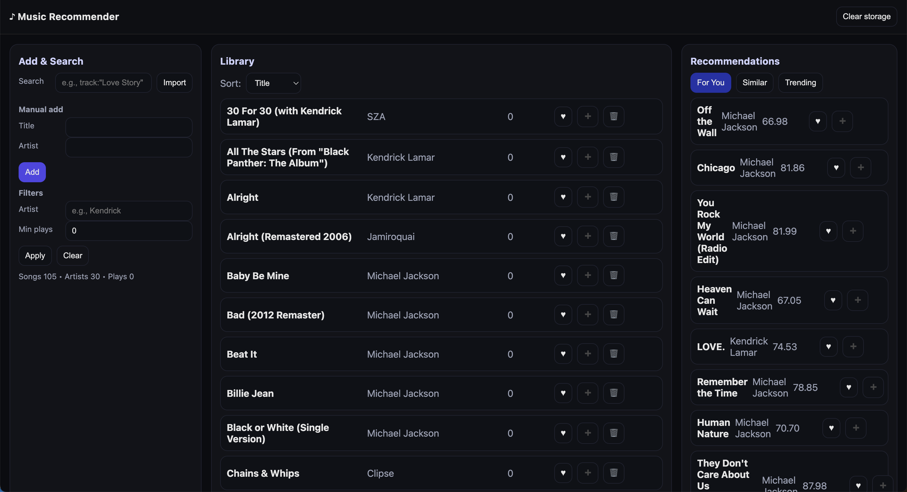
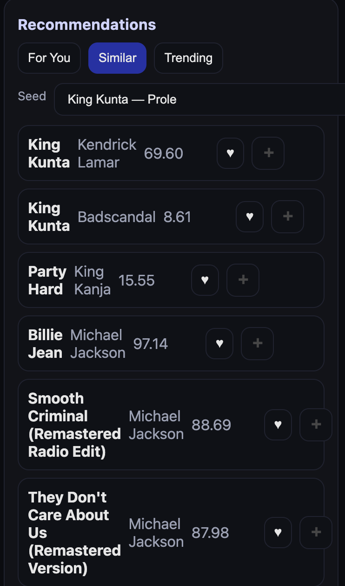
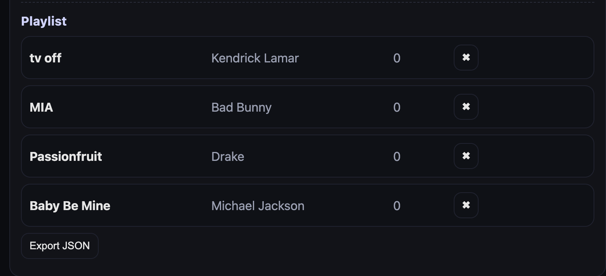

# MelodyMatch: Hybrid Music Recommender

A lightweight hybrid recommender that blends content-based metadata with collaborative user signals to generate ranked, personalized playlists.


---

## Features

### Hybrid Recommendation
- Content-based similarity using song metadata (title, artist, genre, acoustic features)  
- Collaborative filtering based on user-song interactions  
- Weighted hybrid fusion

### Playlist & Search 
- Search by song metadata and return similar tracks
- Create personalized playlists 
- Export playlist to JSON or local CSV

### Lightweight Demo UI
- Static frontend showing search → recommendations → create playlist flow  
- Demo mode supports a sample user with preloaded listening history

## Demo / Screenshots

### 🔎 Overview of UI with Add/Search, Library, and Recommendations


### 🎵 Similar Song Recommendations


### 📋 Playlist Building & Export


---

## Technologies Used

**Backend / ML**
- Python 3.10+
- scikit-learn (baseline models) 

**Frontend**
- HTML5, CSS3, JavaScript

**Serving**
- FastAPI / Flask for lightweight API endpoints

**Data**
- Local CSV / JSON dataset (library, interactions, playlists)
- Deezer API for metadata enrichment 

---

## Using the application

1. **Open the demo UI**  
   - Open in browser: `http://127.0.0.1:5500`  
   - Or, for the static demo (no backend): open `frontend/index.html` directly.

2. **Search for a song or artist**  
   - Type into the **Search** box and press Enter.  
   - Results show matching tracks and a **Recommend** column/list with similar songs.

3. **Build a playlist**  
   - Click **Add → Playlist** on tracks you like to add them to the current playlist.  
   - The playlist panel updates with current selections and length.

4. **Export or inspect results**  
   - Export the playlist via **Export → JSON/CSV** in the UI.  
   - Or run the CLI to get recommendations (prints JSON / writes to `./output/`):
   ```bash
   python src/recommend.py --user-id <id> --topk 10 --checkpoint models/best_checkpoint.pth
